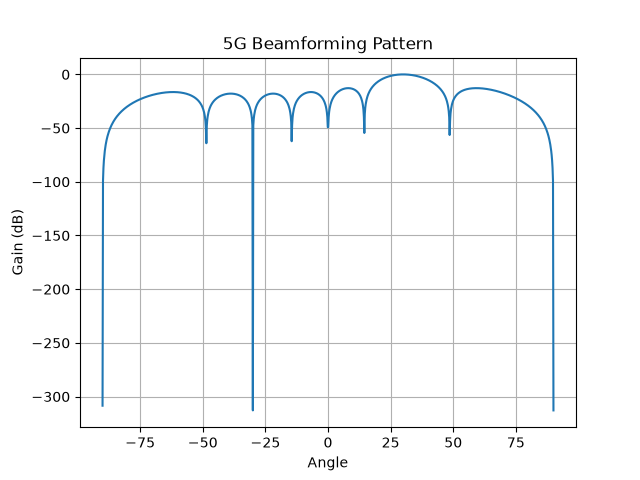

# 5G Beamforming Simulation

## 📌 Project Description

This project simulates beamforming used in 5G communication systems using Python.

## 🛠 Technology Used

- Python
- NumPy
- Matplotlib

## ⚙️ Working

The antenna array focuses signal energy toward a specific direction (30°), improving signal strength and reducing interference.

## 📊 Output

The graph below shows the beamforming radiation pattern.

Author
Sherin Tinu
